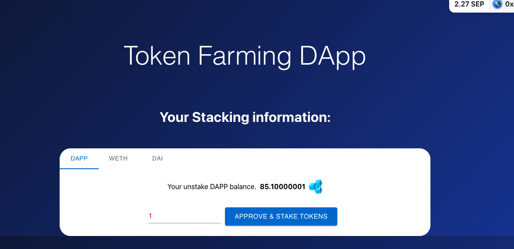

<!-- @format -->

# DEMO

[https://foundry-migration-defi-stake-dapp-40f03dmjb.vercel.app/](https://foundry-migration-defi-stake-dapp-40f03dmjb.vercel.app/)

# English README 　[Jump to Japanese Version](#japanese)

<br/>
<p align="center">

</p>
<br/>

# Note: [February 2024 Update]

-   <span style="color:red;">**⚠️[February 2024 Update]**</span> Now the front-end is fully functional with the Sepolia testnet, and react version `20+`.
-   [DONE] Initially made for the Kovan Network. Migration in progress to Sepolia testnet.
-   [DONE] As Ethers.js V5 is deprecated for the use of Sepolia testnet on the front-end, I am currently updating the code to Ethers.js V6.
-   [DONE] UseDapp is also deprecated, waiting them to update and adapt to Ethers.js V6.
-   [DONE] A change from `Ethers` to `Viem` is in consideration
-   [DONE] Meaning the front-end use a deprecated version of almost everything, but it still works.
-   [DONE] Due to the above deprecation, make sure to use the NodeJs version `16.13.2` and the react version `^17.0.2`.

## DApp Overview

This is a DApp built with React. It provides the following features:

-   When contract is deployed, 1Millions DAPP tokens are minted and sent to the deployer's address. If you want to use it as reward, please change the minting logic in the contract or send them to the TokenFarm contract.

-   **Staking Tokens**: Users can stake the following tokens:
    -   DAPP
    -   DAI
    -   WETH

<span style="color:red;">[For Advanced Features like the below]</span> Buttons and Logic needs to be implemented in the front-end. The contract in itself has those features. <br />
As the front-end is just a basic Approval / Staking demonstration, you can still interact with the contract directly for rewards and unstaking.

There is more features, like:

-   **Rewards**: Depending on the staking period, users are rewarded with "DAPP" tokens.
-   **Unstaking**: Users can unstake their initial stakes or their accumulated rewards at any time.
-   **Totak stake Value**: The total value of the stake.
-   **Token Staked by users**: The amount of token staked by users.
-   **Amount staked by tokens per users**: The amount of token staked by users.
    etc...

## How to Unstake

-   As it is just a basic dapp, you can unstake directly from the contract.
    Go to the contract and call the `unstakeTokens` function with the address of the contract of the token you want to unstake.

```
https://sepolia.etherscan.io/address/[Replace With your TokenFarm contract address]#writeContract
```

## Faucet

-   You need to have `WETH` and `DAI` on sepolia testnet. You can `ETH` them from the faucet [here](https://faucet.sepolia.io/) or the alchemy faucet [here](https://sepolia.alchemyapi.io/).
-   Then you need to `Approve` and `Deposit` ETH in the WETH contract to get WETH. You can do that with the `WETH` contract address and the `Approve` and `Deposit` functions in the `WETH` contract [here](https://sepolia.etherscan.io/token/0x7b79995e5f793a07bc00c21412e50ecae098e7f9#writeContract).

-   For `DAI`, use the `AAVE` testnet faucet [here](https://staging.aave.com/faucet/). Connect With your wallet, Activate testnet in parameters of AAVE and mint `DAI`.

## Getting Started

### Clone the repository

```bash
git clone https://github.com/Jer-B/Foundry_migration_Defi_stake_Dapp
```

-   Change directory

```bash
cd Foundry_migration_Defi_stake_Dapp/contracts
```

### Foundry Initialization

```
forge init
```

-   Install dependencies

```bash
forge install cyfrin/foundry-devops@0.0.11 --no-commit && forge install OpenZeppelin/openzeppelin-contracts@v4.2.0 --no-commit && forge install @chainlink=smartcontractkit/chainlink-brownie-contracts@0.2.1 --no-commit
```

#### Contracts deployment

-   Replace RPC, Private Key and Etherscan API key by yours.

```
forge script script/DeployDappToken.s.sol --rpc-url [YOUR RPC API KEY] --private-key [YOUR PRIVATE KEY] --broadcast --etherscan-api-key [YOUR ETHERSCAN API KEY] -vvv
```

-   Replace those contracts addresses in the `front_end/chain-info/contracts/deployments/map.json` by your DappToken address and your TokenFarm Address :

`front_end/chain-info/contracts/deployments/map.json`

```

    "11155111": {
       "DappToken": ["Your contract address"],
       "TokenFarm": ["Your contract address"]
    },

```

-   `front_end/stc/brownie-config.json` owns DAI and WETH token addresses and pricefeeds for sepolia. If you want to change them for another network.

```
        "sepolia": {
            "verify": true,
            "weth_token": "0x7b79995e5f793A07Bc00c21412e50Ecae098E7f9",
            "fau_token": "0xFF34B3d4Aee8ddCd6F9AFFFB6Fe49bD371b8a357",
            "dai_usd_price_feed": "0x14866185B1962B63C3Ea9E03Bc1da838bab34C19",
            "eth_usd_price_feed": "0x694AA1769357215DE4FAC081bf1f309aDC325306"
        }
```

### Environment variables (Optional)

-   Create an `.env` file in the root directory of the project or rename `.env_example` to `.env`. Then put the below in it, replace the values by yours:

```

NEXT_PUBLIC_WALLET_CONNECT_PROJECT_ID=" YOUR WALLET CONNECT KEY "

```

-   In `App.tsx` replace the `projectId` required for WalletConnect if necessary by your own directly, or change it for an environment variable if you want to use an `.env` file:

```
    projectId: "your_project_id",
```

```
    prokectID: process.env.NEXT_PUBLIC_WALLET_CONNECT_PROJECT_ID,
```

### React Initialization

-   Change directory

```bash
cd Foundry_migration_Defi_stake_Dapp/
```

#### Install dependencies

```bash
yarn
```

#### Run the development server:

-   Run the development server:

```bash
yarn start
```

Open [http://localhost:3000](http://localhost:3000) with your browser to see the result.
<br />
<br />

<a name="japanese"></a>

# 日本語版の README

# 注意: [2024 年 2 月アップデート]

-   <span style="color:red;">**⚠️[2024 年 2 月アップデート]**</span> フロントエンドは現在、Sepolia テストネットおよび React バージョン`20+`で完全に機能しています。
-   [完了] 最初は Kovan ネットワーク用に作成されました。現在 Sepolia テストネットへの移行が進行中です。
-   [完了] Ethers.js V5 は Sepolia テストネットのフロントエンド使用が非推奨になったため、現在 Ethers.js V6 へのコード更新を行っています。
-   [完了] UseDapp も非推奨になっており、Ethers.js V6 に対応するための更新を待っています。
-   [完了] `Ethers` から `Viem` への変更が検討中です。
-   [完了] フロントエンドはほとんど全てのものが非推奨のバージョンを使用していますが、まだ動作しています。
-   [完了] 上記の情報の関係で NodeJs のバージョンは `16.13.2` 、React のバージョンは `^17.0.2` を使用してください。

## DApp 概要

これは React で構築された DApp です。以下の機能を提供します：

-   コントラクトがデプロイされると、100 万 DAPP トークンが発行され、デプロイヤーのアドレスに送られます。これを報酬として使用したい場合は、コントラクトの発行ロジックを変更するか、それらを TokenFarm コントラクトに送ってください。

-   **トークンのステーキング**：ユーザーは以下のトークンをステーキングできます：

    -   DAPP
    -   DAI
    -   WETH

<span style="color:red;">[以下のような高度な機能の場合]</span> ボタンとロジックはフロントエンドで実装する必要があります。コントラクト自体にはこれらの機能があります。<br />
フロントエンドは基本的な承認/ステーキングのデモンストレーションにすぎないため、報酬やアンステーキングのために直接コントラクトとやり取りすることができます。

さらに多くの機能があります：

-   **報酬**：ステーキング期間に応じて、ユーザーは"DAPP"トークンで報酬を受け取ります。
-   **アンステーキング**：ユーザーはいつでも初期のステーキングや時間とともに蓄積された報酬をアンステーキングできます。
-   **トータルステークバリュー**：ステークの総価値。
-   **ユーザーによってステークされたトークン**：ユーザーによってステークされたトークンの量。
-   **ユーザーごとのトークンごとにステークされた量**：ユーザーによってステークされたトークンの量。
    など...

## アンステーク方法

-   これは基本的な dapp なので、コントラクトから直接アンステークすることができます。
    アンステークしたいトークンのコントラクトアドレスを指定して、コントラクトで`unstakeTokens`関数を呼び出してください。

```
https://sepolia.etherscan.io/address/[あなたのTokenFarmコントラクトアドレスに置き換えてください]#writeContract
```

## 蛇口　・　 Faucet（フォーセット）

-   Sepolia テストネットで`WETH`と`DAI`を持っている必要があります。こちらの蛇口[here](https://faucet.sepolia.io/)または Alchemy 蛇口[here](https://sepolia.alchemyapi.io/)から`ETH`を入手できます。
-   その後、`WETH`を取得するために、`WETH`契約で`Approve`および`Deposit`ETH を行う必要があります。`WETH`契約アドレスと`WETH`契約[here](https://sepolia.etherscan.io/token/0x7b79995e5f793a07bc00c21412e50ecae098e7f9#writeContract)の`Approve`および`Deposit`機能を使用してこれを行います。

-   `DAI`の場合は、`AAVE`テストネット蛇口[here](https://staging.aave.com/faucet/)を使用します。ウォレットで接続し、AAVE のパラメータでテストネットをアクティブにして`DAI`をミントします。

## はじめに

### リポジトリのクローン

```bash
git clone https://github.com/Jer-B/Foundry_migration_Defi_stake_Dapp
```

-   ディレクトリを変更

```bash
cd Foundry_migration_Defi_stake_Dapp/contracts
```

### Foundry の初期化

```
forge init
```

-   依存関係のインストール

```bash
forge install cyfrin/foundry-devops@0.0.11 --no-commit && forge install OpenZeppelin/openzeppelin-contracts@v4.2.0 --no-commit && forge install @chainlink=smartcontractkit/chainlink-brownie-contracts@0.2.1 --no-commit
```

#### コントラクトのデプロイメント

-   RPC、プライベートキー、Etherscan の API キーをあなたのものに置き換えてください。

```
forge script script/DeployDappToken.s.sol --rpc-url [YOUR RPC API KEY] --private-key [YOUR PRIVATE KEY] --broadcast --etherscan-api-key [YOUR ETHERSCAN API KEY] -vvv
```

-   `front_end/chain-info/contracts/deployments/map.json` のコントラクトアドレスをあなたの DappToken アドレスと TokenFarm アドレスに置き換えてください。

`front_end/chain-info/contracts/deployments/map.json`

```

    "11155111": {
       "DappToken": ["あなたのコントラクトアドレス"],
       "TokenFarm": ["あなたのコントラクトアドレス"]
    },

```

-   `front_end/stc/brownie-config.json` は、Sepolia 用の DAI および WETH トークンのアドレスとプライスフィードを保有しています。別のネットワークに変更したい場合は、これらを変更してください。

```
        "sepolia": {
            "verify": true,
            "weth_token": "0x7b79995e5f793A07Bc00c21412e50Ecae098E7f9",
            "fau_token": "0xFF34B3d4Aee8ddCd6F9AFFFB6Fe49bD371b8a357",
            "dai_usd_price_feed": "0x14866185B1962B63C3Ea9E03Bc1da838bab34C19",
            "eth_usd_price_feed": "0x694AA1769357215DE4FAC081bf1f309aDC325306"
        }
```

### 環境変数（オプション）

-   プロジェクトのルートディレクトリに `.env` ファイルを作成するか、`.env_example` を `.env` に名前を変更します。次に、以下を追加し、値をあなたのものに置き換えてください：

```
NEXT_PUBLIC_WALLET_CONNECT_PROJECT_ID=" YOUR WALLET CONNECT KEY "

```

-   `App.tsx` で、必要に応じて WalletConnect の `projectId` を直接自分のものに置き換えるか、`.env` ファイルを使用したい場合は環境変数に変更します：

```
    projectId: "your_project_id",
```

```
    prokectID: process.env.NEXT_PUBLIC_WALLET_CONNECT_PROJECT_ID,
```

### React の初期化

-   ディレクトリを変更
-   再考：　 NodeJs のバージョンは `16.13.2` 、React のバージョンは `^17.0.2` を使用してください。

```bash
cd Foundry_migration_Defi_stake_Dapp/
```

#### 依存関係をインストールする

```bash
yarn
```

#### 開発サーバーの実行

-   開発サーバーを実行します:

```bash
yarn start
```

ブラウザで[http://localhost:3000](http://localhost:3000)を開いて結果を確認します。
